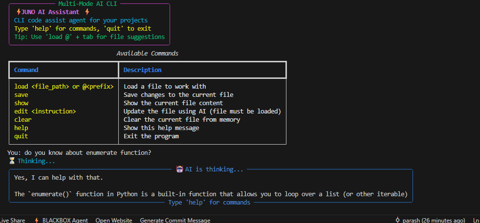
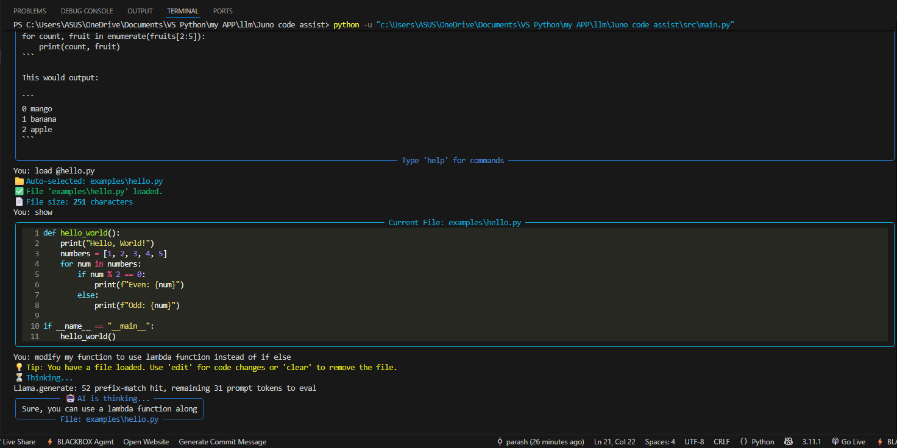

# JUNO - AI Code Assistant 🤖

A powerful **command-line AI assistant, JUNO AI** that can both **edit code files** and act as a **general-purpose AI chatbot**.  

## 📸 Interface

### INIT Interface


### Example Response



## ✨ Features

- **Dual Mode Operation**  
  - Code editor when a file is loaded  
  - General-purpose AI chat when no file is loaded  

- **File Suggestions**  
  - Smart tab completion with `load @prefix` syntax  

- **Rich Interface**  
  - Beautiful terminal UI with syntax highlighting  

- **Multiple Models**  
  - Supports GGUF models like **DeepSeek**, **Mistral**, **CodeLlama**, **Phi**, and more  

---

## 🚀 Step-by-Step Setup Guide

### Step 1: Clone or Download the Project
```bash
# If you have git:
git clone <your-repository-url>
cd ai-code-assistant

# If you don't have git, download the ZIP file and extract it
# then open terminal in the extracted folder
```

### Step 2: Install Python Dependencies
```bash
# Make sure you have Python 3.8+ installed
pip install -r requirements.txt
```

### Step 3: Download the AI Model

Create the models directory:
```bash
mkdir -p models
```

#### Method A: Using wget (Linux/Mac/WSL)
```bash
cd models
wget https://huggingface.co/TheBloke/deepseek-coder-6.7B-instruct-GGUF/resolve/main/deepseek-coder-6.7b-instruct.Q4_K_M.gguf
cd ..
```

#### Method B: Using curl (Linux/Mac/WSL)
```bash
cd models
curl -L -o deepseek-coder-6.7b-instruct.Q4_K_M.gguf https://huggingface.co/TheBloke/deepseek-coder-6.7B-instruct-GGUF/resolve/main/deepseek-coder-6.7b-instruct.Q4_K_M.gguf
cd ..
```

#### Method C: Manual Download (Windows/Mac)
1. Open [this link](https://huggingface.co/TheBloke/deepseek-coder-6.7B-instruct-GGUF/blob/main/deepseek-coder-6.7b-instruct.Q4_K_M.gguf)  
2. Click **Download**  
3. Save the file into the `models/` folder  
4. Ensure the filename is exactly:  
   ```
   deepseek-coder-6.7b-instruct.Q4_K_M.gguf
   ```

### Step 4: Verify the Model File
```bash
ls -la models/
# You should see:
# deepseek-coder-6.7b-instruct.Q4_K_M.gguf
```

### Step 5: Run the Application
```bash
python src/main.py
```

---

## ⚡ Quick Start Examples

Once the app is running, try:

```bash
# Load a file with auto-completion
> load @         # Press Tab to see all files
> load @h        # Press Tab to see files starting with 'h'

# Edit code with AI
> load examples/hello.py
> edit convert the for loop to use list comprehension

# General AI chat
> explain python decorators with examples
> help me plan a workout routine

# Show available commands
> help
```

---

## 🛠 Troubleshooting

- **Model not found error:**  
  - Ensure the model file is in the `models/` folder  
  - Filename must be exactly `deepseek-coder-6.7b-instruct.Q4_K_M.gguf`  

- **Memory issues:**  
  - The model requires ~4GB RAM for Q4_K_M quantization  
  - Close other memory-heavy applications  

- **Slow performance:**  
  - Make sure you have enough RAM  
  - First run may be slower due to model loading  

---

## 🔄 Alternative Models

You can try other models by downloading one of these instead:

- [CodeLlama 7B](https://huggingface.co/TheBloke/CodeLlama-7B-Instruct-GGUF)  
- [Mistral 7B](https://huggingface.co/TheBloke/Mistral-7B-Instruct-v0.1-GGUF)  
- [Phi-2 3B](https://huggingface.co/TheBloke/phi-2-GGUF)  

---

## 💻 System Requirements

- **Python:** 3.8+  
- **RAM:** 8GB+ recommended (4GB minimum)  
- **Storage:** 4GB+ for the model file  
- **OS:** Windows, macOS, or Linux  

---

## 🤝 Need Help?

If you run into issues:
- Double-check setup steps  
- Verify model file path and filename  
- Ensure enough RAM and disk space  
- Check console logs for error messages  

Enjoy your **AI Coding Assistant**! 🚀  
